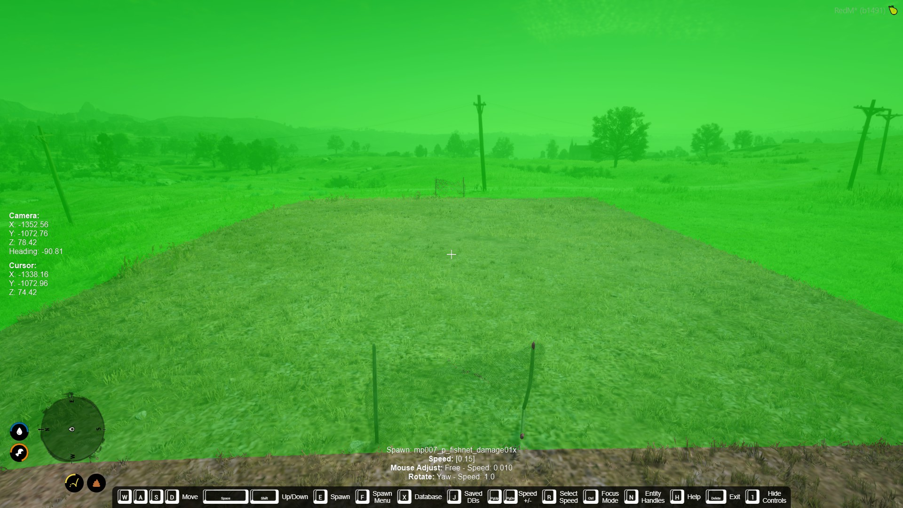

# Moro Soccer

## Description

Moro Soccer is a configurable soccer mini-game for RedM. Players can kick or lob a ball, start and stop matches, and score against multiple goals while spectators receive score updates.
[![[Morojgovany] Soccer script for redm](https://markdown-videos-api.jorgenkh.no/url?url=https%3A%2F%2Fyoutu.be%2FmQWLj4m1JUQ)](https://youtu.be/mQWLj4m1JUQ)
## Features

- Prompts for kicking, lobbing, starting, and stopping the match.
- Optional blip and NPC to mark the field.
- Automatic ball replacement when out of bounds.
- Goal detection with configurable entities or manual scoring.
- Custom whistle sounds for start, goal, stop, and out of bounds.
- Supports multiple goals and keeps score for each.
- Translatable prompts and customizable keybinds.

## Installation

- Place the folder in your resources folder.
- Add `ensure moro_soccer` to your server.cfg.
- Restart your server.

## Dependencies

- [PolyZone](https://github.com/mkafrin/PolyZone) (only needed if you use the field detection or polyzone creation commands).
- [Spooni_spooner](https://github.com/Spooni-Development/spooni_spooner) (only needed if you want to change the field/props)

## Configuration

- Open `config.lua` and adjust values.
- Create a field polyzone with `/pzcreate poly`, `/pzadd`, `/pzfinish`, and replace `Config.field` with the generated data.
- Set `useEntityGoal` to `false` to use real posts and count goals manually.
- Set `useEntityGoal` to `true` and define `goalEntities` to automatically register goals.  
**Warning: The points will be registered when the ball collides with the goal entity.** 
- Customize blip, NPC, kick animation, props, whistle sounds, ball physics, keybinds, and translations.
- Replace the notification logic in `moro_soccer:notify` with your own system if needed.

## Usage

- Go to the configured start coordinates to see the start prompt.
- Press the start prompt key (default **G**) to begin a match and the stop prompt key (default **R**) to end it.
- Kick the ball with the kick key (default **E**) or lobe it with the lob key (default **R**).
- Spectators within `notificationDistance` receive score updates after each goal.

## Change field

- Use spooner & polyzone combined to create a field.
- Replace `Config.field` with the generated data.
- Export the field data to a json file with spooni prop loader.

## important :
- Goals must be against the field bounds, otherwise players and ball can pass behind the goal and score.

## Credits

- Created by Morojgovany.
- Credits to spooni_spooner & polyzone.
